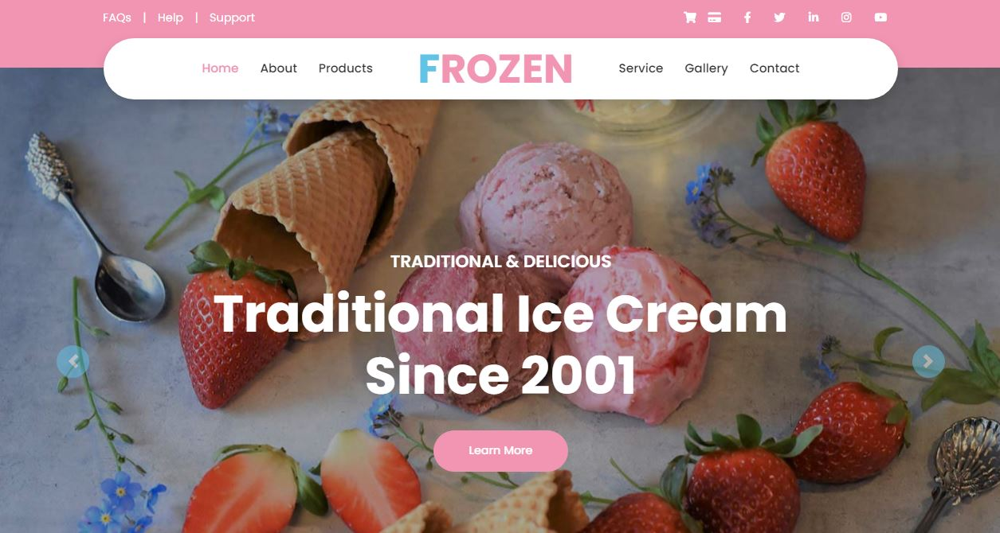

# Frozen &middot; [](https://github.com/DulangaDasanayake/ice-cream-shop-laravel/blob/main/LICENSE) [](https://github.com/DulangaDasanayake/ice-cream-shop-laravel/pulls)

Remember to give me your generous ⭐ Thanks you so very much !!!

A delightful ice cream shop web application built with Laravel. Browse our flavors, place orders, and manage your account with ease! Stay tuned for updates.



## Table of Contents

- [Features](#features)
- [Used Technologies](#used-technologies)
- [Installation](#installation)
- [Usage](#usage)
- [Contributing](#contributing)
- [License](#license)

### Features

- Browse ice cream flavors
- Product reviews and ratings system
- Shopping cart for easy order placement
- User profile with order history
- Admin product management
- Admin user management
- Admin order details page
- Checkout process (shipping, payment method, etc)
- PayPal / credit card integration
- Database seeder (products & users)


### Used Technologies

- **Frontend:**

  - Blade templating engine
  - Bootstrap for CSS styling

- **Backend:**

  - Laravel for MVC framework
  - Eloquent ORM for database interactions
  - Laravel Sanctum for authentication

- **Database**

  - MySQL for product & user detail storing.

- **Payment**

  - PayPal & Card payment methods are available.

- **Hosting:**

  - [Your Hosting Provider] for deployment and hosting
  - Web App Demo Link:

### Installation

1. **Clone the repository:**

   ```bash
   git clone https://github.com/DulangaDasanayake/ice-cream-shop-laravel.git
