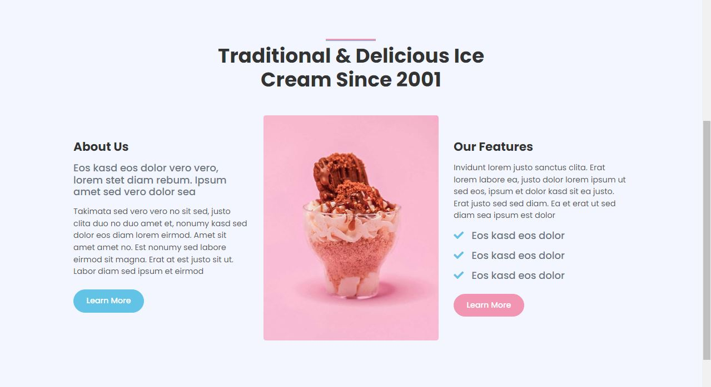

# Frozen &middot; [](https://github.com/DulangaDasanayake/ice-cream-shop-laravel/blob/main/LICENSE) [](https://github.com/DulangaDasanayake/ice-cream-shop-laravel/pulls)

Remember to give me your generous ⭐ Thanks you so very much !!!

A delightful ice cream shop web application built with Laravel. Browse our flavors, place orders, and manage your account with ease! Stay tuned for updates.


## Table of Contents

- [Features](#features)
- [Used Technologies](#used-technologies)
- [Installation](#installation)
- [Usage](#usage)
- [Contributing](#contributing)
- [License](#license)

### Features

- Browse ice cream flavors
- Product reviews and ratings system
- Shopping cart for easy order placement
- User profile with order history
- Admin product management
- Admin user management
- Admin order details page
- Checkout process (shipping, payment method, etc)
- PayPal / credit card integration
- Database seeder (products & users)

### Gallery


### Contact


### Services


### About



### Used Technologies

- **Frontend:**

  - Blade templating engine
  - Bootstrap for CSS styling

- **Backend:**

  - Laravel for MVC framework
  - Eloquent ORM for database interactions
  - Laravel Sanctum for authentication

- **Database**

  - MySQL for product & user detail storing.

- **Payment**

  - PayPal & Card payment methods are available.

- **Hosting:**

  - Project will deploy later.
  - Web App Demo Link:

### Installation

1. **Clone the repository:**

   ```bash
   git clone https://github.com/DulangaDasanayake/ice-cream-shop-laravel.git
   ```

2. **Navigate to the project directory:**

   ```bash
   cd ice-cream-shop-laravel
   ```

3. **Install dependencies:**

   ```bash
   composer install
   ```

4. **Set up environment variables:**

   Rename the `.env.example` file to `.env` and configure the following variables:
   Replace `your_database_name`, `your_database_username`, `your_database_password`, and `your_paypal_client_id` with your actual values.

   ```bash
   APP_NAME=Frozen
   APP_ENV=local
   APP_KEY=base64:your-app-key
   APP_DEBUG=true
   APP_URL=http://localhost

   LOG_CHANNEL=stack

   DB_CONNECTION=mysql
   DB_HOST=127.0.0.1
   DB_PORT=3306
   DB_DATABASE=your_database_name
   DB_USERNAME=your_database_username
   DB_PASSWORD=your_database_password

   PAYPAL_CLIENT_ID=your_paypal_client_id
   ```

5. **Run database migrations and seeders:**

   ```bash
   php artisan migrate --seed
   ```

### Usage

1. **Start the Laravel development server:**

   ```bash
   php artisan serve
   ```

2. **Open your browser and navigate to `http://localhost:8000` to view the application.**

### Contributing

Contributors are warmly welcome! If you'd like to contribute to this project, please follow these steps:

1. Fork the repository.
2. Create a new branch (`git checkout -b feature/new-feature`).
3. Make your changes.
4. Commit your changes (`git commit -am 'Add new feature'`).
5. Push to the branch (`git push origin feature/new-feature`).
6. Create a new Pull Request.

### License

This project is licensed under the MIT License - see the [LICENSE](LICENSE) file for details.

### Thanks Giving ❤️

Thanks to the Laravel team, Bootstrap developers, PayPal, and all contributors who have made this project possible. Your support is greatly appreciated!
